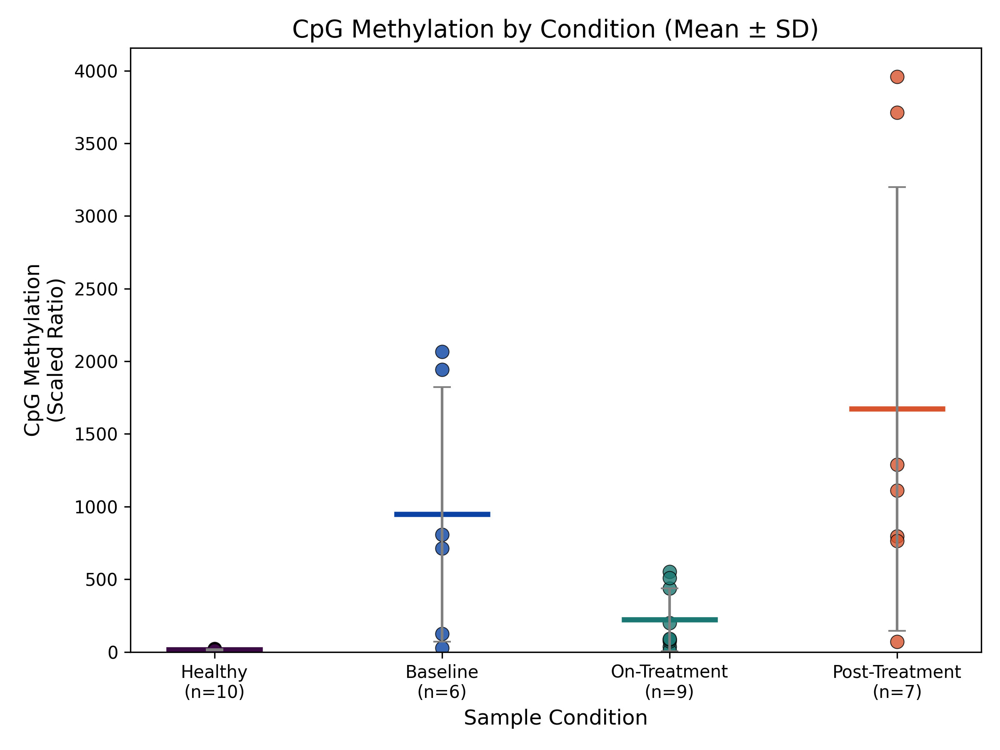
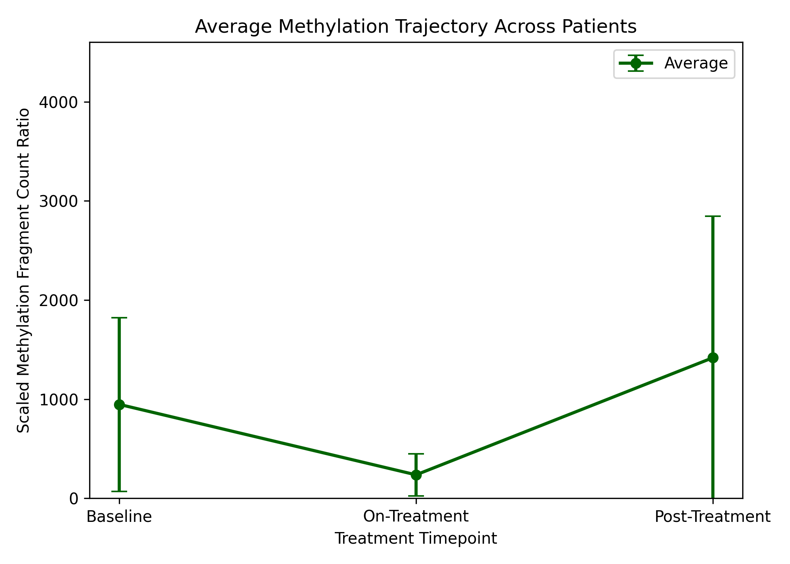
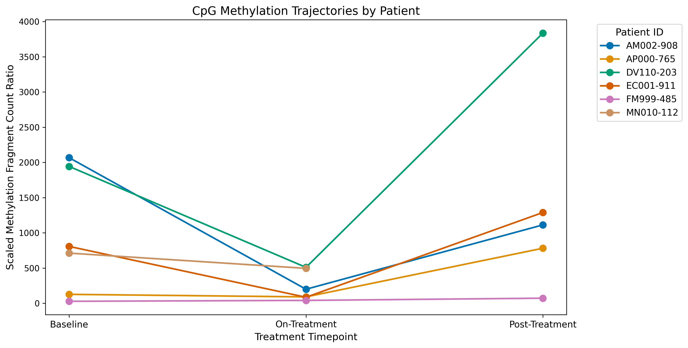
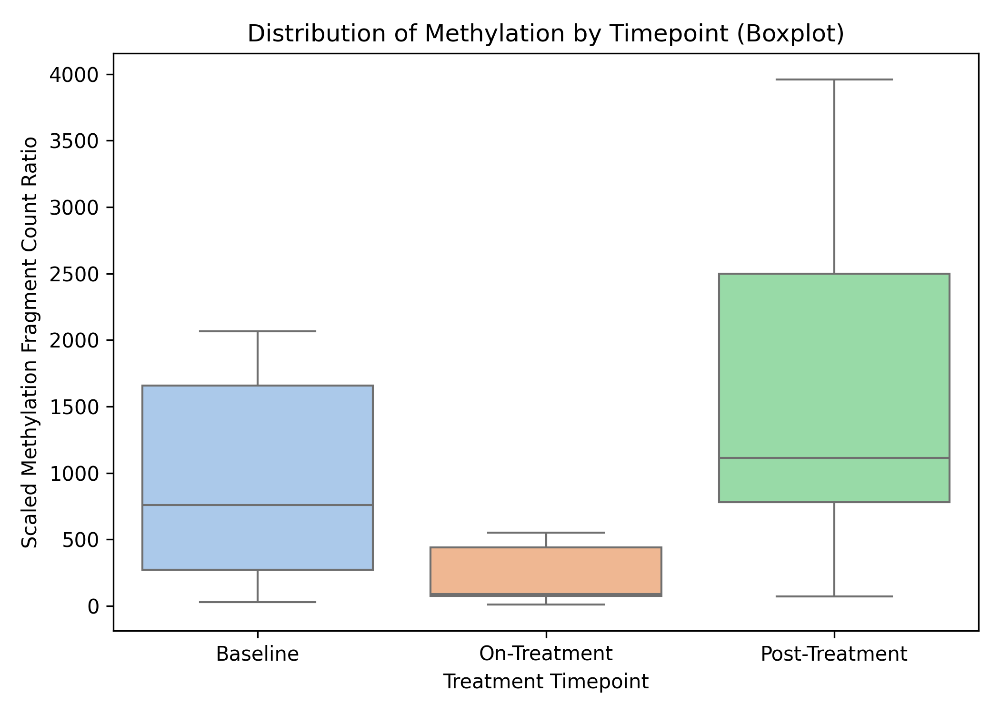
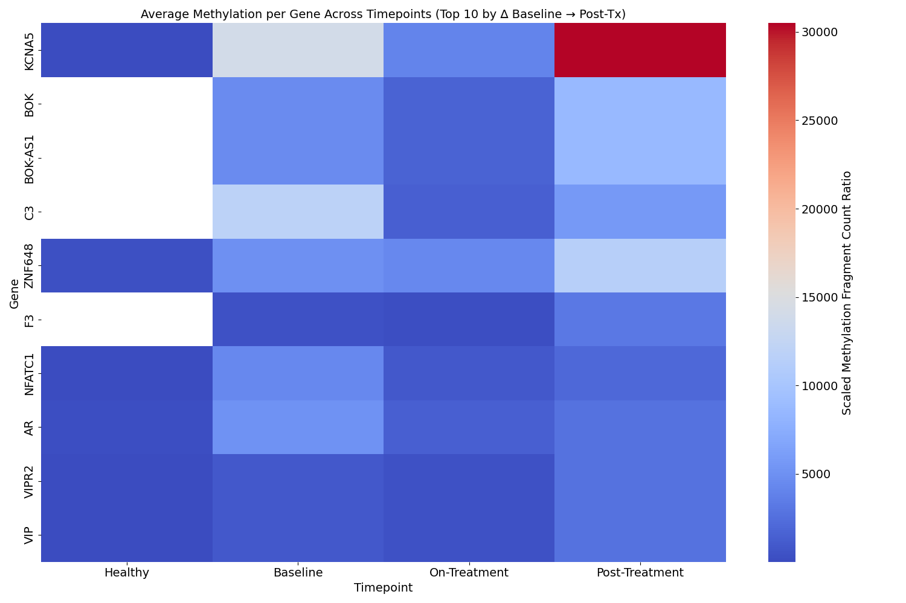

# 🧬 Methylation Pipeline

This repository contains preprocessing and visualization tools for analyzing DNA methylation changes across treatment timepoints using filtered EMseq data. It is useful for following longitudinal studies.

## 🔧 Preprocessing Steps

These scripts help prepare your input methylation data.

### Step 1: Filter Methylation Files by Patient ID
- Script: `scripts/step_1_filter_patients_local.py`
- Applies to all methylation Excel files and a patient ID list.
- Filters large Excel files to retain only samples from selected patients.
- Outputs one filtered Excel file per original input in the output directory (e.g. `EMSeq-NN-Run-1_CG80_CH20_Tot10_Glob20_cpgi_counts.xlsx_samples-of-interest`)
- Sample output(s):

| Header                  |   MN010-112_Baseline_2018.05.11 |   MN010-112_C2D1_2018.06.18 |   MN010-112_C3D1_2018.07.16 |   EC001-911_Baseline_2018.10.05 |   EC001-911_C3D1_2018.12.07 |   EC001-911_C7D1-Off-tx_2019.03.29 |   DV110-203_Baseline_2018.05.14 |   DV110-203_C1D15_2018.05.30 |   DV110-203_C3D1-Off-tx_2018.07.18_Replicate-Barcode-13 |   DV110-203_C3D1-Off-tx_2018.07.18_Replicate-Barcode-8 |   AM002-908_Baseline_2018.05.23 |   AM002-908_C2D1_2018.06.28 |   AM002-908_Off-tx_2018.07.18 |   AP000-765_Baseline_2017.03.04 |   AP000-765_C1D15_2017.03.23 |   AP000-765_Off-tx_2017.05.05_Replicate-Barcode-17_Pool-3 |   AP000-765_Off-tx_2017.05.05_Replicate-Barcode-17_Pool-4 |
|:------------------------|--------------------------------:|----------------------------:|----------------------------:|--------------------------------:|----------------------------:|-----------------------------------:|--------------------------------:|-----------------------------:|--------------------------------------------------------:|-------------------------------------------------------:|--------------------------------:|----------------------------:|------------------------------:|--------------------------------:|-----------------------------:|----------------------------------------------------------:|----------------------------------------------------------:|
| Info_EMSeq              |                        20       |                     20      |                    20       |                              20 |                    20       |                                 20 |                              20 |                           20 |                                                      20 |                                                     20 |                              20 |                          20 |                        20     |                        20       |                           20 |                                                        20 |                                                        20 |
| Info_Pool               |                         4       |                      4      |                     4       |                               4 |                     4       |                                  4 |                               1 |                            1 |                                                       1 |                                                      1 |                               1 |                           1 |                         1     |                         4       |                            4 |                                                         3 |                                                         4 |
| Info_Barcode            |                        21       |                     22      |                    23       |                              18 |                    19       |                                 20 |                               6 |                            7 |                                                      13 |                                                      8 |                               9 |                          10 |                        11     |                        15       |                           16 |                                                        17 |                                                        17 |
| Info_Index              |                         4       |                      4      |                     4       |                               4 |                     4       |                                  4 |                               1 |                            1 |                                                       1 |                                                      1 |                               1 |                           1 |                         1     |                         4       |                            4 |                                                         3 |                                                         4 |
| Info_DNA-Input-Blunting |                         7.12308 |                      3.0988 |                     6.98218 |                              14 |                     4.88543 |                                 14 |                              14 |                           14 |                                                      14 |                                                     14 |                              14 |                          14 |                        11.013 |                         3.94445 |                           14 |                                                        14 |                                                        14 |

#### 📁 Input File Requirements
- One Excel file with patient IDs (e.g. `patient_list.xlsx`)
  - IDs must be in the first column.
  - Sample input patient ID file:

    | Patient ID   |
    |:-------------|
    | EC001-911    |
    | MN010-112    |
    | DV110-203    |
    | AM002-908    |
    | AP000-765    |
- One or more methylation Excel files
  - Columns should contain patient IDs in their names.
  - Sample input methylation file:

| Header                  |   MN010-112_Baseline_2018.05.11 |   MN010-112_C2D1_2018.06.18 |   MN010-112_C3D1_2018.07.16 |   ALN0114-D_2005.04.07 |   ALN0114-E_2005.05.19 |   ALN0114-H_2005.06.30 |   ANS0122-A_2015.01.05 |   ANS0122-B_2015.01.12 |   ANS0122-C_2015.01.21 |   ANS0122-D__2015.01.29_Replicate-Barcode-12_Pool-3 |   ANS0122-D__2015.01.29_Replicate-Barcode-12_Pool-4 |   EC001-911_Baseline_2018.10.05 |   EC001-911_C3D1_2018.12.07 |   EC001-911_C7D1-Off-tx_2019.03.29 |   DV110-203_Baseline_2018.05.14 |   DV110-203_C1D15_2018.05.30 |   DV110-203_C3D1-Off-tx_2018.07.18_Replicate-Barcode-13 |   DV110-203_C3D1-Off-tx_2018.07.18_Replicate-Barcode-8 |   AM002-908_Baseline_2018.05.23 |   AM002-908_C2D1_2018.06.28 |   AM002-908_Off-tx_2018.07.18 |   JEOL9923-B_2014.10.24 |   JEOL9923-C_2014.12.05 |   AP000-765_Baseline_2017.03.04 |   AP000-765_C1D15_2017.03.23 |   AP000-765_Off-tx_2017.05.05_Replicate-Barcode-17_Pool-3 |   AP000-765_Off-tx_2017.05.05_Replicate-Barcode-17_Pool-4 |   OP3475-L10-AC_EoT_2016.04.29 |   OP3475-L10-AC_Post-SBRT-C1D1_2015.11.24 |   OP3475-L10-AC_Post-SBRT-C2D1_2015.12.14 |   OP3475-L10-AC_Post-SBRT-C3D1_2016.01.04 |   OP3475-L10-AC_Pre-SBRT-C1D1_2015.05.07 |   OP3475-L10-AC_Pre-SBRT-C2D1_2015.05.28 |   OP3475-L10-AC_Pre-SBRT-C5D1_2015.08.17 |   OP3475-L22-MB_Gamma-Knife_2015.09.30 |   RD3475-L22-MB_Pre-SBRT-C1D1_2015.07.01 |   RD3475-L22-MB_Pre-SBRT-C2D1_2015.07.22 |   RD3475-L22-MB_Pre-SBRT-C3D1_2015.08.12 |   RD3475-L22-MB_Pre-SBRT-C4D1_2015.09.02 |   OP3475-L28-RL_Pre-SBRT-C1D1_2015.09.04 |   OP3475-L28-RL_Pre-SBRT-C2D1_2015.09.24 |   OP3475-L28-RL_Pre-SBRT-C3D1_2015.10.13 |   OP3475-L28-RL_Progression_2015.11.18_Replicate-Barcode-12 |   OP3475-L28-RL_Progression_2015.11.18_Replicate-Barcode-23 |   OP3475-L30-AL_at-SBRT_2016.06.20 |   OP3475-L30-AL_Pre-SBRT-C1D1_2015.09.22 |   OP3475-L30-AL_Pre-SBRT-C2D1_2015.10.13 |   OP3475-L30-AL_Pre-SBRT-C3D1_2015.11.03 |   OP3475-L30-AL_Pre-SBRT-C4D1_2015.12.02 |   BAPJO-37_2018.04.19 |   BAPJO-38_2018.04.19 |   BAPJO-48_2018.05.09 |
|:------------------------|--------------------------------:|----------------------------:|----------------------------:|-------------------------:|-------------------------:|-------------------------:|-------------------------:|-------------------------:|-------------------------:|------------------------------------------------------:|------------------------------------------------------:|--------------------------------:|----------------------------:|-----------------------------------:|--------------------------------:|-----------------------------:|--------------------------------------------------------:|-------------------------------------------------------:|--------------------------------:|----------------------------:|------------------------------:|-------------------------:|-------------------------:|--------------------------------:|-----------------------------:|----------------------------------------------------------:|----------------------------------------------------------:|-------------------------------:|------------------------------------------:|------------------------------------------:|------------------------------------------:|-----------------------------------------:|-----------------------------------------:|-----------------------------------------:|---------------------------------------:|-----------------------------------------:|-----------------------------------------:|-----------------------------------------:|-----------------------------------------:|-----------------------------------------:|-----------------------------------------:|-----------------------------------------:|------------------------------------------------------------:|------------------------------------------------------------:|-----------------------------------:|-----------------------------------------:|-----------------------------------------:|-----------------------------------------:|-----------------------------------------:|-----------------------:|-----------------------:|-----------------------:|
| Info_EMSeq              |                        20       |                     20      |                    20       |                 20       |                       20 |                       20 |                       20 |                       20 |                       20 |                                                    20 |                                                    20 |                              20 |                    20       |                                 20 |                              20 |                           20 |                                                      20 |                                                     20 |                              20 |                          20 |                        20     |                  20      |                  20      |                        20       |                           20 |                                                        20 |                                                        20 |                       20       |                                  20       |                                  20       |                                  20       |                                 20       |                                 20       |                                 20       |                                     20 |                                 20       |                                 20       |                                 20       |                                20        |                                  20      |                                   20     |                                  20      |                                                          20 |                                                          20 |                           20       |                                 20       |                                 20       |                                20        |                                 20       |                     20 |                     20 |                     20 |
| Info_Pool               |                         4       |                      4      |                     4       |                  3       |                        3 |                        3 |                        3 |                        3 |                        3 |                                                     3 |                                                     4 |                               4 |                     4       |                                  4 |                               1 |                            1 |                                                       1 |                                                      1 |                               1 |                           1 |                         1     |                   4      |                   4      |                         4       |                            4 |                                                         3 |                                                         4 |                        2       |                                   2       |                                   2       |                                   2       |                                  2       |                                  2       |                                  2       |                                      1 |                                  1       |                                  1       |                                  1       |                                 1        |                                   2      |                                    2     |                                   2      |                                                           2 |                                                           2 |                            3       |                                  3       |                                  3       |                                 3        |                                  3       |                      4 |                      2 |                      1 |
| Info_Barcode            |                        21       |                     22      |                    23       |                  1       |                        2 |                        3 |                        9 |                       10 |                       11 |                                                    12 |                                                    12 |                              18 |                    19       |                                 20 |                               6 |                            7 |                                                      13 |                                                      8 |                               9 |                          10 |                        11     |                  13      |                  14      |                        15       |                           16 |                                                        17 |                                                        17 |                       19       |                                  16       |                                  17       |                                  18       |                                 13       |                                 14       |                                 15       |                                      5 |                                  1       |                                  2       |                                  3       |                                 4        |                                  20      |                                   21     |                                  22      |                                                          12 |                                                          23 |                            8       |                                  4       |                                  5       |                                 6        |                                  7       |                     24 |                     24 |                     12 |
| Info_Index              |                         4       |                      4      |                     4       |                  3       |                        3 |                        3 |                        3 |                        3 |                        3 |                                                     3 |                                                     4 |                               4 |                     4       |                                  4 |                               1 |                            1 |                                                       1 |                                                      1 |                               1 |                           1 |                         1     |                   4      |                   4      |                         4       |                            4 |                                                         3 |                                                         4 |                        2       |                                   2       |                                   2       |                                   2       |                                  2       |                                  2       |                                  2       |                                      1 |                                  1       |                                  1       |                                  1       |                                 1        |                                   2      |                                    2     |                                   2      |                                                           2 |                                                           2 |                            3       |                                  3       |                                  3       |                                 3        |                                  3       |                      4 |                      2 |                      1 |
| Info_DNA-Input-Blunting |                         7.12308 |                      3.0988 |                     6.98218 |                  8.75072 |                       14 |                       14 |                       14 |                       14 |                       14 |                                                    14 |                                                    14 |                              14 |                     4.88543 |                                 14 |                              14 |                           14 |                                                      14 |                                                     14 |                              14 |                          14 |                        11.013 |                  12.4047 |                  12.2146 |                         3.94445 |                           14 |                                                        14 |                                                        14 |                        8.18321 |                                   9.68955 |                                   5.13633 |                                   8.76775 |                                  1.82199 |                                  4.79705 |                                  4.77461 |                                     14 |                                  4.55867 |                                  5.38689 |                                  5.92059 |                                 0.983236 |                                  11.6451 |                                   13.413 |                                  13.9199 |                                                          14 |                                                          14 |                            8.39411 |                                  2.88868 |                                  4.56094 |                                 0.917137 |                                  2.38761 |                      8 |                      8 |                      8 |

These input files are used at the start of Step 1. Place them in a `data/` folder. Filtered outputs will be saved to an `output/` folder and will be needed for downstream analysis.

### Step 2 (Optional): Merge Filtered Files from Multiple EMseq Runs
- Script: `scripts/step_2_merge_filtered_files.py`
- Auto-detect file(s):
- Required only if you have `.xlsx` outputs from multiple different EMseq batches.
- Produces one merged file for unified analysis in the output directory (e.g. `merged_output_glob20.xlsx`, `merged_output_globmin80.xlsx`)

| Header                      | INNOV_LS-24-11024   | INNOV_LS-24-11027   | INNOV_LS-24-11029   | INNOV_LS-24-11045   | INNOV_LS-24-11046   | INNOV_LS-24-11047   | INNOV_LS-24-11050   | INNOV_LS-24-11072   | INNOV_LS-24-11073   | INNOV_LS-24-11074   | LOI_FM999-485_Baseline   | LOI_FM999-485_C1D4-7   | LOI_FM999-485_C4D1   | LOI_FM999-485_C8D1   | LOI_FM999-485_C9D1-Off-tx   | MN010-112_Baseline_2018.05.11   | MN010-112_C2D1_2018.06.18   | MN010-112_C3D1_2018.07.16   | EC001-911_Baseline_2018.10.05   | EC001-911_C3D1_2018.12.07   | EC001-911_C7D1-Off-tx_2019.03.29   | DV110-203_Baseline_2018.05.14   | DV110-203_C1D15_2018.05.30   | DV110-203_C3D1-Off-tx_2018.07.18_Replicate-Barcode-13   | DV110-203_C3D1-Off-tx_2018.07.18_Replicate-Barcode-8   | AM002-908_Baseline_2018.05.23   | AM002-908_C2D1_2018.06.28   | AM002-908_Off-tx_2018.07.18   | AP000-765_Baseline_2017.03.04   | AP000-765_C1D15_2017.03.23   | AP000-765_Off-tx_2017.05.05_Replicate-Barcode-17_Pool-3   | AP000-765_Off-tx_2017.05.05_Replicate-Barcode-17_Pool-4   |
|:----------------------------|:--------------------|:--------------------|:--------------------|:--------------------|:--------------------|:--------------------|:--------------------|:--------------------|:--------------------|:--------------------|:-------------------------|:-----------------------|:---------------------|:---------------------|:----------------------------|:--------------------------------|:----------------------------|:----------------------------|:--------------------------------|:----------------------------|:-----------------------------------|:--------------------------------|:-----------------------------|:--------------------------------------------------------|:-------------------------------------------------------|:--------------------------------|:----------------------------|:------------------------------|:--------------------------------|:-----------------------------|:----------------------------------------------------------|:----------------------------------------------------------|
| Info_EMSeq                  | 16                  | 16                  | 16                  | 16                  | 16                  | 16                  | 16                  | 16                  | 16                  | 16                  | 18                       | 18                     | 18                   | 18                   | 18                          | 20                              | 20                          | 20                          | 20                              | 20                          | 20                                 | 20                              | 20                           | 20                                                      | 20                                                     | 20                              | 20                          | 20                            | 20                              | 20                           | 20                                                        | 20                                                        |
| Info_Pool                   | 2                   | 2                   | 2                   | 1                   | 1                   | 2                   | 2                   | 1                   | 1                   | 1                   | Q                        | Q                      | Q                    | Q                    | Q                           | 4                               | 4                           | 4                           | 4                               | 4                           | 4                                  | 1                               | 1                            | 1                                                       | 1                                                      | 1                               | 1                           | 1                             | 4                               | 4                            | 3                                                         | 4                                                         |
| Info_Barcode                | 8                   | 9                   | 10                  | 2                   | 1                   | 6                   | 7                   | 3                   | 4                   | 5                   | 7                        | 8                      | 9                    | 10                   | 11                          | 21                              | 22                          | 23                          | 18                              | 19                          | 20                                 | 6                               | 7                            | 13                                                      | 8                                                      | 9                               | 10                          | 11                            | 15                              | 16                           | 17                                                        | 17                                                        |
| C methylated in CpG context | 94.1%               | 94.2%               | 94.2%               | 94.1%               | 93.6%               | 94.2%               | 94.0%               | 93.8%               | 93.5%               | 94.0%               | 93.6%                    | 93.8%                  | 92.7%                | 92.7%                | 93.2%                       | 91.8%                           | 91.8%                       | 92.2%                       | 91.9%                           | 91.7%                       | 91.7%                              | 92.6%                           | 92.5%                        | 93.1%                                                   | 93.4%                                                  | 91.9%                           | 91.4%                       | 92.1%                         | 93.0%                           | 93.0%                        | 94.0%                                                     | 93.1%                                                     |
| C methylated in CHG context | 10.7%               | 10.6%               | 10.7%               | 14.1%               | 13.7%               | 10.9%               | 10.1%               | 13.2%               | 14.0%               | 13.6%               | 30.8%                    | 25.9%                  | 27.1%                | 26.0%                | 25.2%                       | 5.6%                            | 6.7%                        | 5.8%                        | 6.8%                            | 6.0%                        | 6.6%                               | 6.8%                            | 7.0%                         | 7.3%                                                    | 8.4%                                                   | 6.9%                            | 6.8%                        | 7.2%                          | 6.4%                            | 7.4%                         | 4.1%                                                      | 5.8%                                                      |


### Step 3: Convert to Aberrant Signals
- Script: `scripts/step_3_convert_to_aberrant_signals.py` 
- Auto-detect file(s):
- Takes the cpgi methylation fragment counts in Glob20 Excel files and divides them by corresponding values in GlobMin80 Excel files to create methylation fragment ratios. Then, scales those numbers up to >1 by multiplying 1000 each.
- Produces `scaled_fragment_ratios_matrix.xlsx` in the output directory.
- Sample output:

| Header                                                            |   INNOV_LS-24-11024 |   INNOV_LS-24-11027 |   INNOV_LS-24-11029 |   INNOV_LS-24-11045 |   INNOV_LS-24-11046 |   INNOV_LS-24-11047 |   INNOV_LS-24-11050 |   INNOV_LS-24-11072 |   INNOV_LS-24-11073 |   INNOV_LS-24-11074 |   LOI_FM999-485_Baseline |   LOI_FM999-485_C1D4-7 |   LOI_FM999-485_C4D1 |   LOI_FM999-485_C8D1 |   LOI_FM999-485_C9D1-Off-tx |   MN010-112_Baseline_2018.05.11 |   MN010-112_C2D1_2018.06.18 |   MN010-112_C3D1_2018.07.16 |   EC001-911_Baseline_2018.10.05 |   EC001-911_C3D1_2018.12.07 |   EC001-911_C7D1-Off-tx_2019.03.29 |   DV110-203_Baseline_2018.05.14 |   DV110-203_C1D15_2018.05.30 |   DV110-203_C3D1-Off-tx_2018.07.18_Replicate-Barcode-13 |   DV110-203_C3D1-Off-tx_2018.07.18_Replicate-Barcode-8 |   AM002-908_Baseline_2018.05.23 |   AM002-908_C2D1_2018.06.28 |   AM002-908_Off-tx_2018.07.18 |   AP000-765_Baseline_2017.03.04 |   AP000-765_C1D15_2017.03.23 |   AP000-765_Off-tx_2017.05.05_Replicate-Barcode-17_Pool-3 |   AP000-765_Off-tx_2017.05.05_Replicate-Barcode-17_Pool-4 |
|:------------------------------------------------------------------|--------------------:|--------------------:|--------------------:|--------------------:|--------------------:|--------------------:|--------------------:|--------------------:|--------------------:|--------------------:|-------------------------:|-----------------------:|---------------------:|---------------------:|----------------------------:|--------------------------------:|----------------------------:|----------------------------:|--------------------------------:|----------------------------:|-----------------------------------:|--------------------------------:|-----------------------------:|--------------------------------------------------------:|-------------------------------------------------------:|--------------------------------:|----------------------------:|------------------------------:|--------------------------------:|-----------------------------:|----------------------------------------------------------:|----------------------------------------------------------:|
| Total CpG island fragments counts for this particular spreadsheet |             14.8957 |             22.0357 |             17.8042 |             16.1035 |              9.9451 |              19.694 |             11.4869 |             15.2609 |             14.3348 |             11.0945 |                  27.5086 |                 36.196 |              10.3381 |              73.6927 |                     71.4704 |                         711.685 |                      438.71 |                     551.793 |                         806.838 |                     84.9377 |                            1288.25 |                         1942.78 |                      509.272 |                                                 3959.09 |                                                3711.38 |                         2066.79 |                     198.589 |                       1112.34 |                         126.354 |                      90.1857 |                                                   796.686 |                                                   765.174 |
| CGI_chr1_778604_779167_LOC100288069_0                             |            nan      |            nan      |            nan      |            nan      |            nan      |             nan     |            nan      |            nan      |            nan      |            nan      |                 nan      |                nan     |             nan      |             nan      |                    nan      |                         nan     |                      nan    |                     nan     |                         nan     |                    nan      |                             nan    |                          nan    |                      nan     |                                                  nan    |                                                 nan    |                          nan    |                     nan     |                        nan    |                         nan     |                     nan      |                                                   nan     |                                                   nan     |
| CGI_chr1_827036_828065_LINC00115_LINC01128_0                      |            nan      |            nan      |            nan      |            nan      |            nan      |             nan     |            nan      |            nan      |            nan      |            nan      |                 nan      |                nan     |             nan      |             nan      |                    nan      |                         nan     |                      nan    |                     nan     |                         nan     |                    nan      |                             nan    |                          nan    |                      nan     |                                                  nan    |                                                 nan    |                          nan    |                     nan     |                        nan    |                         nan     |                     nan      |                                                   nan     |                                                   nan     |
| CGI_chr1_869818_870248_FAM41C_0                                   |            nan      |            nan      |            nan      |            nan      |            nan      |             nan     |            nan      |            nan      |            nan      |            nan      |                 nan      |                nan     |             nan      |             nan      |                    nan      |                         nan     |                      nan    |                     nan     |                         nan     |                    nan      |                             nan    |                          nan    |                      nan     |                                                  nan    |                                                 nan    |                          nan    |                     nan     |                        nan    |                         nan     |                     nan      |                                                   nan     |                                                   nan     |
| CGI_chr1_923590_926252_LOC107985728_SAMD11_0                      |            nan      |            nan      |            nan      |            nan      |            nan      |             nan     |            nan      |            nan      |            nan      |            nan      |                 nan      |                nan     |             nan      |             nan      |                    nan      |                         nan     |                      nan    |                     nan     |                         nan     |                    nan      |                             nan    |                          nan    |                      nan     |                                                  nan    |                                                 nan    |                          nan    |                     nan     |                        nan    |                         nan     |                     nan      |                                                   nan     |                                                   nan     |


### Step 4 (Optional): Annotate Genes
- Script: `scripts/step_4_generate_gene_annotation.py`
- Required only if you are going to run `scripts/locus/deltagene-heatmaps-lineplots-bothfonts-labels.py` later.
- Auto-detect file(s): an Excel file containing "matrix" in its name
- Reads an Excel file containing "matrix" in its name and processes its content to generate a CSV file with structured gene annotation data:
  - Extracts CGI names from the first column, filtering those starting with "CGI_".
  - Processes each CGI name by splitting it into parts and extracting chromosome, start and end genomic coordinates, gene names, and probe IDs.
- Produces `structured_gene_annotation.csv` in the output directory.
- Sample output:

| chr   |   start genomic coordinate |   end genomic coordinate | Gene1        | Gene2     |   Gene3 |   Gene4 |   Gene5 |   Gene6 |   Gene7 |   Gene8 |   Gene9 |   Gene10 |   Gene11 |   Gene12 |   Gene13 |   Gene14 |   Gene15 |   Gene16 |   Gene17 |   Gene18 |   Gene19 |   Gene20 |   Gene21 |   Gene22 |   CGI index or probe ID |
|:------|---------------------------:|-------------------------:|:-------------|:----------|--------:|--------:|--------:|--------:|--------:|--------:|--------:|---------:|---------:|---------:|---------:|---------:|---------:|---------:|---------:|---------:|---------:|---------:|---------:|---------:|------------------------:|
| chr1  |                     778604 |                   779167 | LOC100288069 | nan       |     nan |     nan |     nan |     nan |     nan |     nan |     nan |      nan |      nan |      nan |      nan |      nan |      nan |      nan |      nan |      nan |      nan |      nan |      nan |      nan |                       0 |
| chr1  |                     827036 |                   828065 | LINC00115    | LINC01128 |     nan |     nan |     nan |     nan |     nan |     nan |     nan |      nan |      nan |      nan |      nan |      nan |      nan |      nan |      nan |      nan |      nan |      nan |      nan |      nan |                       0 |
| chr1  |                     869818 |                   870248 | FAM41C       | nan       |     nan |     nan |     nan |     nan |     nan |     nan |     nan |      nan |      nan |      nan |      nan |      nan |      nan |      nan |      nan |      nan |      nan |      nan |      nan |      nan |                       0 |
| chr1  |                     923590 |                   926252 | LOC107985728 | SAMD11    |     nan |     nan |     nan |     nan |     nan |     nan |     nan |      nan |      nan |      nan |      nan |      nan |      nan |      nan |      nan |      nan |      nan |      nan |      nan |      nan |                       0 |
| chr1  |                     940225 |                   942983 | SAMD11       | nan       |     nan |     nan |     nan |     nan |     nan |     nan |     nan |      nan |      nan |      nan |      nan |      nan |      nan |      nan |      nan |      nan |      nan |      nan |      nan |      nan |                       0 |

### Step 5 (Optional): Build a CGI Map
- Script: `scripts/step_5_build_gene_cgi_map.py`
- Required only if you are going to run `scripts/locus/deltagene-heatmaps-lineplots-bothfonts-labels.py` later.
- Auto-detect file(s): .xlsx and .csv files in the output directory that contain the term "gene_annotation" in their filename
  - You had to have run Step 4 of the Preprocessing Steps (`scripts/step_4_generate_gene_annotation.py`) for this file to have been generated in your output directory.
- Processes these files to create a mapping of genes to CGI identifiers:
  - The script selects the first file from the list of matching files and prints its name.
  - The script identifies all columns in the DataFrame that start with "Gene".
  - It reshapes the DataFrame into a long format where each row represents a gene and its associated CGI.
  - The script creates a cgi_id column in the format chr:start-end
  - The final gene_cgi_map DataFrame is created by selecting the cgi_id and gene_name columns and removing duplicates.
  - The script saves the gene_cgi_map DataFrame as a CSV file in the output directory.
- Generated file(s): `gene_cgi_map.csv` in the output directory
- Sample output:

| cgi_id             | gene_name    |
|:-------------------|:-------------|
| chr1:778604-779167 | LOC100288069 |
| chr1:827036-828065 | LINC00115    |
| chr1:869818-870248 | FAM41C       |
| chr1:923590-926252 | LOC107985728 |
| chr1:940225-942983 | SAMD11       |

## 🌐 Global-Level (Patient / Timepoint) Analysis

This workflow focuses on overall methylation trends per patient or treatment condition.

### Generate Dotplots by Condition/Timepoint
- Script: `scripts/global/dotplots-by-condition.py`
- Auto-detect file(s): Excel file(s) located in the output directory that contains "fragment_ratios_matrix" in its name
  - You had to have run Step 3 of the Preprocessing Steps (scripts/step_3_convert_to_aberrant_signals.py) for this file to have been generated in your output directory.
- Data Processing Steps:
  - Classifies samples into conditions (Healthy, Baseline, On-Treatment, Post-Treatment).
  - Calculates summary statistics (Mean, Median, Standard Deviation), and generates two types of scatter plots: Median Scatter Plot and Mean ± SD Scatter Plot.
- Generated file(s):
  - A CSV file containing summary statistics (Mean, Median, Standard Deviation) for each condition is saved as `*_summary_stats.csv` in the plots/dotplots directory.
  - Resulting plots are saved as `*_median_dotplot.png` and `*_mean_sd_dotplot.png` in the plots/dotplots directory.
- Sample output(s):



### Generate Trajectory Lineplots, Boxplots and Violin + Swarm Overlay Plots by Condition/Timepoint
- Script: `scripts/global/lineplots-perpatient_v3.py`
- Auto-detect file(s): .xlsx or .xls file(s) located in the output directory that contains "scaled_fragment_ratios_matrix" in its name
  - You had to have run Step 3 of the Preprocessing Steps (scripts/step_3_convert_to_aberrant_signals.py) for this file to have been generated in your output directory.
- Generated file(s):
  - Main Plot Directory: plots/lineplots
    - methylation_longitudinal_plot.png
    - average_trajectory.png
    - boxplot_by_timepoint.png
    - violinplot_by_timepoint.png
  - Per Patient Plot Directory: plots/lineplots/per_patient
    - Individual patient plots in the format {Patient_ID}.png
  - Replicate Table Directory: output/per_patient_tables
    - Replicate tables for each patient in the format {Patient_ID}.csv
  - Metadata and Summary Files Directory: output
    - sample_metadata.csv
    - summary_statistics.csv
    - per_patient_summary.csv
    - boxplot_summary_by_timepoint.csv
- Sample output(s):





## 🔍 Locus-Level (CpG Island / Gene) Analysis
This workflow zooms into locus-specific (CpG island or gene-level) methylation dynamics.

### Generate Average Methylation Change per Chromosome
Looking across chromosomes, we can identify global trends—such as whether certain chromosomes are more epigenetically active or suppressed in response to treatment.​
- Script: `scripts/locus/avg-methylation-change-per-chromosome.py`
- Auto-detect file(s):
  - Patient file: a "patient" file in the data directory
  - Methylation file: a "scaled" methylation file in the output directory
    - You had to have run Step 3 of the Preprocessing Steps (`scripts/step_3_convert_to_aberrant_signals.py`) for this file to have been generated in your output directory.
- Data Processing Steps:
  - Loads the patient file and extracts patient IDs.
  - Loads the methylation data file and prepares it for analysis by extracting CpG island data.
  - Identifies and normalizes timepoints in the sample data (e.g., Baseline, On-Treatment, Post-Treatment, Healthy).
  - Filters and structures the data for valid samples, excluding "Healthy" samples.
  - Calculates the average methylation levels for each chromosome.
  - Computes the changes (deltas) in methylation levels between different timepoints for each patient and chromosome.
  - Summarizes the mean changes in methylation levels for each chromosome and comparison. Saves the summary data as an Excel file in the plots directory.
  - Creates bar and line plots to visualize the average methylation changes per chromosome for different comparisons. Plots are ordered by chromosome number (karyotype order) and designed for intuitive interpretation. Saves the plots as PNG files in the plots directory.
- Generated file(s): plots/avg-methylation-change-per-chromosome directory
  - Plot: A PNG file named chr_avg_overlay_<base_fname>_aligned.png
  - Excel Summary: An Excel file named chr_avg_summary_<base_fname>.xlsx
- Sample output(s):


### Generate Bubble Plots for Visualization of Longitudinal DNA Hypermethylation Profiles per Chromosome
- Script: `scripts/locus/bubbleplot_generator_v8_gridsoff.py`
- Auto-detect file(s):
  - Patient file: a "patient" file in the data directory (both .xlsx and .csv formats)
  - Methylation file: a "ratios_matrix" methylation file in the output directory (both .xlsx and .csv formats)
    - You had to have run Step 3 of the Preprocessing Steps (`scripts/step_3_convert_to_aberrant_signals.py`) for this file to have been generated in your output directory.
- Data Processing Steps:
  - Normalizes sample names to standard timepoints such as "Baseline", "On-Treatment", and "Post-Treatment".
  - Processes each methylation data file to extract CpG Island coordinates and associated values, and merges this data with sample metadata.
- Data Visualization Steps:
- Per Patient Per Chromosome: Generates bubble plots for each patient and chromosome combination, showing the DNA hypermethylation profiles across different timepoints.
- Per Chromosome (Averaged Across Patients): Generates bubble plots for each chromosome, averaged across all patients, to visualize overall methylation patterns.
- Saves the generated plots as PNG and SVG files in the plots directory.
- Creates a ZIP file (bubbleplots.zip) containing all the plot files.
- Deletes the individual plot files after zipping to save space.
- Generated file(s): plots/bubbleplots.zip directory
  - Bubble plots saved as PNG and SVG files in the plots directory.
- Sample output(s):


### Generate Heatmaps and Lineplots of Top 10 Genes by Condition/Timepoint
- Script: `scripts/locus/deltagene-heatmaps-lineplots-bothfonts-labels.py`
- Auto-detect file(s):
  - CpG Methylation Matrix
    - Directory: output
    - Identifier: Contains the keyword "matrix"
    - Format: .xlsx or .txt
    - You had to have run Step 3 of the Preprocessing Steps (`scripts/step_3_convert_to_aberrant_signals.py`) for this file to have been generated in your output directory.
  - Patient List
    - Directory: data
    - Identifier: Contains the keyword "patient"
    - Format: .xlsx
  - Gene Annotation Map
    - Directory: output
    - Identifier: Contains the keyword "cgi_map"
    - Format: .xlsx or .csv
    - You have to have run Step 5 of the Preprocessing Steps (`scripts/step_5_build_gene_cgi_map.py`) for this file to have been generated in your output directory.
- Data Processing Steps:
  - Loads CpG methylation matrix, patient list, and gene annotation map.
  - Matches CpGs to genes and filters genes with multiple CpGs.
  - Calculates delta methylation values between specified timepoints and performs paired t-tests.
  - Generates delta values and statistical comparison results for:
    - Baseline vs Post-Treatment
    - Baseline vs On-Treatment
    - On-Treatment vs Post-Treatment
  - Saves delta values and t-test results to CSV files in the plots/heatmaps-lineplots directory.
  - Identifies top 10 genes with highest delta values (Baseline to Post-Treatment).
  - Computes average gene methylation values and constructs a gene matrix.
- Data Visualization Steps:
  - Generates heatmaps and line plots for average gene methylation across timepoints.
  - Saves heatmaps and line plots to the plots/heatmaps-lineplots directory.
- Generated file(s): plots/heatmaps-lineplots directory
  - Delta Values and T-Test Results
    - gene_deltas_all_comparisons.csv
    - baseline_vs_post_ttest.csv
    - baseline_vs_on_ttest.csv
    - on_vs_post_ttest.csv
  - Average Visualizations (Across Patients)
    - avg_methylation_heatmap.png
    - avg_methylation_lineplot.png
  - Per-Patient Visualizations and Matrices
    - heatmap_{patient}.png
    - lineplot_{patient}.png
    - methylation_matrix_{patient}.csv
- Sample output(s):



### Identify Top 10 Differentially Methylated CGI Subregions and Top 10 Differentially Methylated Genes
- Script: `scripts/locus/top10dm-plots.py`
- Auto-detect file(s):
  - Patient Files: It searches for Excel files containing the term "patient id" in the data directory.
  - Methylation Matrix Files: It searches for Excel files containing the term "matrix" in the output directory.
    - You had to have run Step 3 of the Preprocessing Steps (scripts/step_3_convert_to_aberrant_signals.py) for this file to have been generated in your output directory.
- Data Processing Steps:
  - Extracts CpG island data from the matrix file.
  - Generates metadata for each sample, including patient ID and treatment timepoint (Baseline, On-Treatment, Post-Treatment, Healthy).
  - Filters samples to exclude those labeled as "Healthy".
  - Constructs a matrix with methylation data, grouped by patient and timepoint.
  - Collapses the matrix to average methylation levels for each CpG island across patients and timepoints.
  - Calculates average changes in methylation levels between different treatment timepoints (Baseline vs Post-Treatment, Baseline vs On-Treatment, On-Treatment vs Post-Treatment).
- Data Visualization Steps:
  - Top 10 Differentially Methylated CpG Subregions:
    - Plots bar charts for the top 10 CpG islands with the highest average changes in methylation levels between treatment timepoints. Saves these plots as PNG files in the plots directory.
  - Genes with Multiple Affected CpG Islands:
    - Identifies genes with more than one affected CpG island and plots bar charts for these genes. Saves these plots as PNG files in the plots directory.
- Generated file(s): plots/top-10-differential-methylation-plots.zip directory
  - top10_diff_CGIsubregions_baseline_post.png
  - multi_CpG_genes_baseline_post.png
  - top10_diff_CGIsubregions_baseline_on.png
  - multi_CpG_genes_baseline_on.png
  - top10_diff_CGIsubregions_on_post.png
  - multi_CpG_genes_on_post.png


---

## ▶️ How to Use

### Run Locally
- Clone the repository:
  ```bash
  git clone https://github.com/codebyesther/methylation-pipeline.git
  cd methylation-pipeline
  ```
- Install dependencies:
  ```bash
  pip install pandas numpy openpyxl matplotlib seaborn scipy tqdm
  ```
- Place your input `.xlsx` files in a `data/` folder.
- Run the script (e.g. `step_1_filter_patients.py`):
  ```bash
  python scripts/step_1_filter_patients.py
  ```


---

## 📂 Project Structure

```
methylation-pipeline/
├── data/                      # Input Excel files
├── output/                    # Filtered and merged outputs
├── plots/                     # Generated plots and Excel summaries
├── scripts/
│   ├── step_1_filter_patients_local.py
│   ├── step_2_merge_filtered_files.py
│   ├── step_3_convert_to_aberrant_signals.py
│   ├── step_4_generate_gene_annotation.py
│   ├── step_5_build_gene_cgi_map.py
│   ├── global/
│   │   ├── dotplots-by-condition.py
│   │   └── lineplots-perpatient_v3.py
│   └── locus/
│       ├── avg-methylation-change-per-chromosome.py
│       ├── bubbleplot_generator_v8_gridsoff.py
│       ├── bubbleplot_generator_v8.py
│       ├── deltagene-heatmaps-lineplots-bothfonts-labels.py
│       └── top10dm-plots.py
├── .gitignore
├── CITATION.cff
├── LICENSE
├── README.md
└── requirements.txt

```

## 📦 Dependencies

Install all requirements at once:

```bash
pip install -r requirements.txt
```

- `pandas`
- `numpy`
- `openpyxl`
- `matplotlib`
- `seaborn`
- `scipy`
- `tqdm`


## 🧠 Additional Context: Data Annotation Format
A breakdown of CGI names (i.e. `CGI_chr1_778604_779167_LOC100288069_0`) can be done to interpret CGI identifiers:
- `CGI_` → prefix 
- `chr1` → chromosome
- `778604_779167` → genomic coordinates
- `LOC100288069` → gene name
- `_0` → sometimes denotes CpG island index or probe ID

Hopefully, this helps you understand the CpG region labels.

---

## 📜 License

This project is licensed under the MIT License.

## 🧾 Citation

Please cite this work if you use any scripts or plots from this repository.
[](https://doi.org/10.5281/zenodo.15150516)

**Suggested citation:**
```
Choi, E. (2025). *Methylation-Pipeline* (v1.0.0). Zenodo. https://doi.org/10.5281/zenodo.15150516
```

You can also find formal citation formats in the `CITATION.cff` file or by clicking **"Cite this repository"** on GitHub.

If you use or adapt specific components, please mention the relevant script in your methods or supplementary material.
